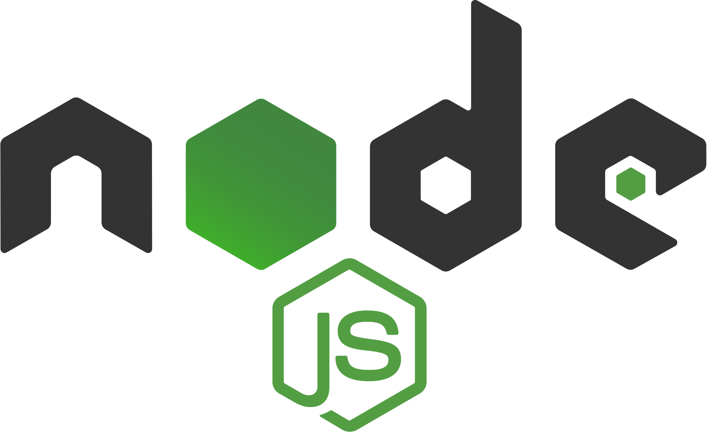

<div style="display:flex; align-items: center">
  
  <h1 style="position:relative; top: -6px" >Covid Questionaire</h1>
</div>

---

Covid Questionaire collects information about the covid situation and work preferences from users.

#

## Table of Contents

- [Table of Contents](#table-of-contents)
- [Prerequisites](#prerequisites)
- [Tech Stack](#tech-stack)
- [Getting Started](#getting-started)
- [Testing](#testing)
- [Project Structure](#project-structure)
- [Resources](#resources)

## Prerequisites

-  _Node JS @12.X and up_
-  _npm @6 and up_

#

## Tech Stack

-  [React @18.0.0](https://reactjs.org) - front-end framework
-  [React Hook Form @7.30.0](https://react-hook-form.com/) - flexible and extensible forms with easy-to-use validation.
-  [tailwindcss @3.0.24](https://tailwindcss.com/) - css framework
-  [cypress @9.6.0](https://www.cypress.io/) - JavaScript End to End Testing Framework

#

## Getting Started

1\. First of all you need to clone repository from github:

```sh
git clone https://github.com/RedberryInternship/covid19-Var-Saba.git
```

2\. Next step requires install all the dependencies.

```sh
npm install
```

or

```sh
yarn install
```

3\. after that you can run Covid Questionaire application from terminal:

```sh
npm start
```

Runs the app in the development mode. Open http://localhost:3000 to view it in your browser.

You can learn more in the [Create React App documentation.](https://create-react-app.dev/docs/getting-started/)
To learn React, check out the [React documentation.](https://reactjs.org/)

#

## Testing

1\. Run application from the terminal

```sh
npm start
```

2\. start cypress

```sh
npx cypress open
```

In order to see coverage of testing go to coverage/lcov-report and open index.html

#

## Project Structure

```bash
├─── cypress # project test files
├─── readme  # readme assets
├─── src     # project source codes
│    ├── assets      # project images and fonts 
│    ├── components  # reusable components
│    │   └── svgs            # svg components
│    ├── helper      # helper functions
│    ├── pages       # project pages
│    │   ├── Covid
│    │   │   └── components # page components
│    │   ├── CovidPolicy    # project page
│    │   │   └── components # page components
│    │   ├── Identification # project page
│    │   │   └── components # page components
│    │   ├── StartingPage   # project page
│    │   └── Vaccinated     # project page
│    │       └── components # page components
│    │           └── suggestions # suggestions of radio inputs
│    └── state        # context api
- .eslintrc.json      # eslint config file
- .gitignore          # gitignore config file
- .prettierrc.js      # prettier config file
- cypress.json        # cypress config file
- jsconfig.json       # config file for absolute path
- package.json        # dependency manager configurations
- tailwind.config.js  # tailwindcss config file

```

#

## Resources

- [Application Design [Figma]](https://www.figma.com/file/56t2BI25FcD0LAIjR4GVkQ/%E1%83%99%E1%83%98%E1%83%97%E1%83%AE%E1%83%95%E1%83%90%E1%83%A0%E1%83%98?node-id=37%3A3)
- [Application Design Prototype](https://www.figma.com/proto/56t2BI25FcD0LAIjR4GVkQ/%E1%83%99%E1%83%98%E1%83%97%E1%83%AE%E1%83%95%E1%83%90%E1%83%A0%E1%83%98?node-id=37%3A3&starting-point-node-id=1%3A2&scaling=contain)
- [Git commit rules](https://redberry.gitbook.io/resources/git-is-semantikuri-komitebi)
- [Font [BPG Arial]](https://fonts.ge/ka/font/13/BPG-Arial)
