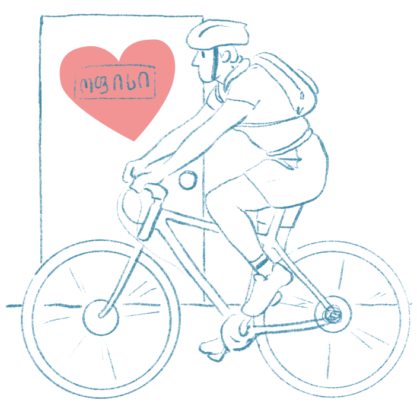
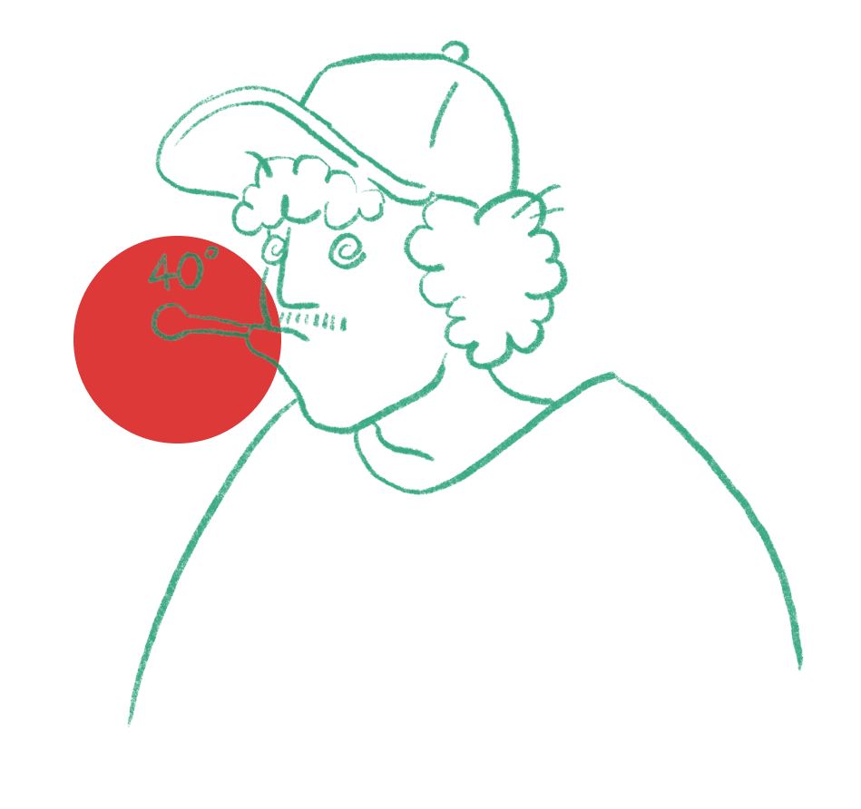

<div style="display:flex; align-items: center">
  
  <h1 style="position:relative; top: -6px" >Covid Questionaire</h1>
</div>

---

Covid Questionaire collects information about the covid situation and work preferences from users.

#

### Table of Contents

- [Table of Contents](#table-of-contents)
- [Prerequisites](#prerequisites)
- [Tech Stack](#tech-stack)
- [Getting Started](#getting-started)
- [Project Structure](#project-structure)
- [Resources (images)](#resources-images)

### Prerequisites

-  _Node JS @12.X and up_
-  _npm @6 and up_

#

### Tech Stack

-  [React @18.0.0](https://reactjs.org) - front-end framework
-  [React Hook Form @7.30.0](https://react-hook-form.com/) - flexible and extensible forms with easy-to-use validation.
-  [tailwindcss @3.0.24](https://reactjs.org) - css framework

#

### Getting Started

1\. First of all you need to clone repository from github:

```sh
git clone https://github.com/RedberryInternship/covid19-Var-Saba.git
```

2\. Next step requires install all the dependencies.

```sh
npm install
```

or

```sh
yarn install
```

3\. after that you can run Covid Questionaire application from terminal:

```sh
npm start
```

Runs the app in the development mode. Open http://localhost:3000 to view it in your browser.

You can learn more in the [Create React App documentation.](https://create-react-app.dev/docs/getting-started/)
To learn React, check out the [React documentation.](https://reactjs.org/)

#

### Project Structure

```bash
├─── readme   # readme assets
├─── src      # project source codes
│    ├── Assets      # project images and fonts
│    ├── Components  # project components
│    │   ├── CovidInputs           # input components of covid page
│    │   ├── CovidPolicyInputs     # input components of covid policy page
│    │   ├── IdentificationInputs  # input components of identification page
│    │   ├── Reusables             # reusable components
│    │   ├── svgs                  # svg assets
│    │   └── VaccinatedInputs      # input components of vaccinated page
│    │       └── Suggestions       # suggestion components
│    ├── context      # context api
│    ├── Layouts      # reusable layout component
│    ├── Pages        # project pages
│    ├── UI           # wrapper component
- .eslintrc.json      # eslint config file
- .gitignore          # gitignore config file
- .prettierrc.js      # prettier config file
- jsconfig.json       # config file for absolute path
- package.json        # dependency manager configurations
- tailwind.config.js  # tailwindcss config file

```

### Resources (images)

|                                                                                   |                                                                                    |                                                                       |
| :-------------------------------------------------------------------------------: | :--------------------------------------------------------------------------------: | :-------------------------------------------------------------------: |
|  |  |         |
|         |                  |  |
